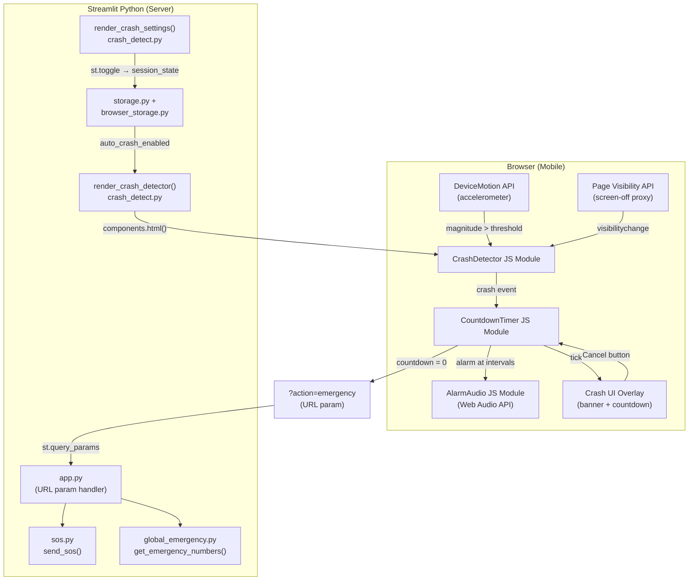
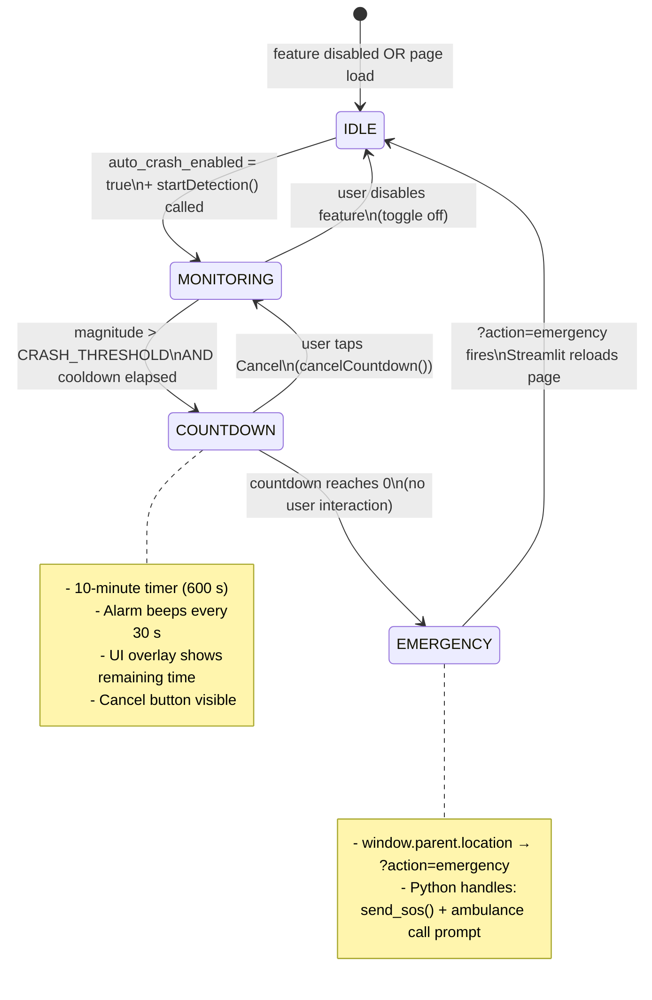
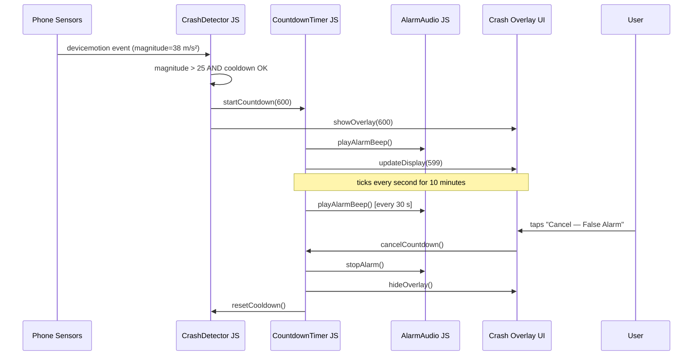
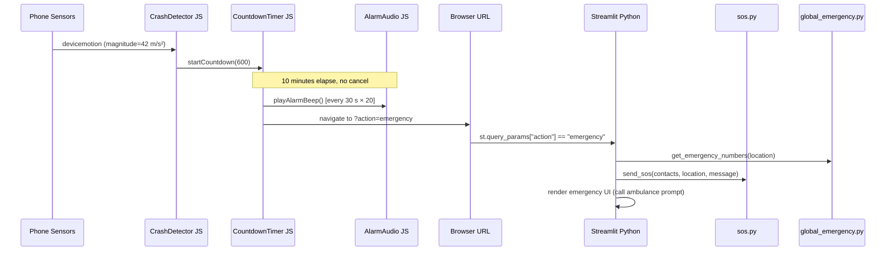

# Design Document: Auto Crash Detection

## Overview

The Auto Crash Detection feature extends the existing accelerometer-based crash detection in `crash_detect.py` to include a configurable 10-minute safety countdown with an audible alarm, a user-cancellable false-alarm window, and an automatic emergency trigger (ambulance call + SOS SMS) if the countdown expires without user intervention. The feature is fully opt-in via a toggle stored in session state and persisted to browser localStorage and the JSON file store.

The entire countdown, alarm, and auto-trigger logic runs in browser JavaScript (injected via `streamlit.components.v1.components.html()`), because Streamlit cannot run background Python timers. Communication back to Python happens through URL query parameters (`?action=emergency`), matching the existing pattern used by the rest of the app.

The feature also adds a secondary detection signal — screen-off / page-visibility loss combined with sustained high-magnitude readings — as a lightweight proxy for "phone damage / user unconscious" to complement the raw accelerometer threshold.

---

## Architecture




---

## State Machine — Crash Detection Lifecycle



---

## Sequence Diagrams

### Happy Path — Crash Detected, User Cancels (False Alarm)



### Auto-Trigger Path — User Unconscious



---

## Components and Interfaces

### Component 1: CrashDetector JS Module

**Purpose**: Listens to `DeviceMotion` and `visibilitychange` events; decides when a crash has occurred and delegates to the countdown timer.

**Interface** (exposed on `window`):

```javascript
window.startCrashDetection()   // Initialise listeners; requests iOS permission if needed
window.stopCrashDetection()    // Remove listeners; used when feature is toggled off
window.cancelCountdown()       // Proxy to CountdownTimer.cancel(); exposed for overlay button
```

**Responsibilities**:
- Request `DeviceMotionEvent` permission on iOS 13+
- Compute acceleration magnitude from `accelerationIncludingGravity`
- Enforce cooldown between consecutive triggers
- Detect secondary signal: page hidden (`document.visibilityState === 'hidden'`) while magnitude was recently high
- Delegate to `CountdownTimer.start()` on confirmed crash event

---

### Component 2: CountdownTimer JS Module

**Purpose**: Manages the 10-minute countdown, drives UI updates, fires alarm at intervals, and triggers the emergency URL redirect on expiry.

**Interface**:

```javascript
CountdownTimer.start(durationSeconds)  // Begin countdown; idempotent if already running
CountdownTimer.cancel()                // Abort countdown; reset state
CountdownTimer.isRunning()             // Returns boolean
```

**Responsibilities**:
- `setInterval`-based 1-second tick
- Persist countdown start time to `sessionStorage` so a page refresh mid-countdown can resume
- Call `AlarmAudio.beep()` every `ALARM_INTERVAL_S` seconds
- On expiry: call `AlarmAudio.stop()` then navigate to `?action=emergency`
- On cancel: call `AlarmAudio.stop()`, hide overlay, reset state

---

### Component 3: AlarmAudio JS Module

**Purpose**: Generates an audible alarm using the Web Audio API — no external audio files required.

**Interface**:

```javascript
AlarmAudio.beep()   // Play a single alarm tone (handles iOS unlock requirement)
AlarmAudio.stop()   // Stop any ongoing tone
AlarmAudio.unlock() // Call on first user gesture to unlock iOS audio context
```

**Responsibilities**:
- Create and manage a single `AudioContext` instance
- Generate a 880 Hz sine wave burst (0.6 s) for each beep
- Apply gain envelope (attack/release) to avoid clicks
- Handle `AudioContext` suspended state gracefully (iOS requires user gesture)
- Expose `unlock()` to be called on the Cancel button's `touchstart` event (satisfies iOS gesture requirement even if user doesn't cancel)

---

### Component 4: Crash Overlay UI

**Purpose**: Full-screen overlay shown during the countdown; displays remaining time and the cancel button.

**Responsibilities**:
- Fixed-position overlay covering the entire viewport
- Large countdown timer display (MM:SS)
- Pulsing red visual indicator
- "Cancel — False Alarm" button (calls `CountdownTimer.cancel()`)
- Accessible: `role="alertdialog"`, `aria-live="assertive"` for screen readers

---

### Component 5: `render_crash_detector()` — Python (crash_detect.py)

**Purpose**: Injects the combined JS + HTML overlay into the Streamlit page.

**Interface**:

```python
def render_crash_detector(
    enabled: bool = True,
    crash_threshold: float = 25.0,
    countdown_seconds: int = 600,
    alarm_interval_seconds: int = 30,
) -> None:
    """
    Injects accelerometer crash detection with 10-minute safety countdown.

    Parameters
    ----------
    enabled : bool
        If False, injects a no-op stub. Controlled by session_state.auto_crash_enabled.
    crash_threshold : float
        Acceleration magnitude in m/s² that triggers detection. Default 25.
    countdown_seconds : int
        Duration of the safety countdown before auto-triggering emergency. Default 600 (10 min).
    alarm_interval_seconds : int
        How often (in seconds) the alarm beeps during the countdown. Default 30.
    """
```

---

### Component 6: `render_crash_settings()` — Python (crash_detect.py)

**Purpose**: Renders the settings toggle and optional threshold slider in the Streamlit sidebar.

**Interface**:

```python
def render_crash_settings() -> None:
    """
    Renders the Auto Crash Detection settings UI in the sidebar.
    Reads/writes:
        st.session_state.auto_crash_enabled  (bool)
        st.session_state.crash_threshold     (float, optional advanced setting)
    Persists changes via save_user_data() and save_to_browser().
    """
```


---

## Data Models

### Session State Keys (new)

```python
# Added to st.session_state by render_crash_settings()
st.session_state.auto_crash_enabled: bool   # Feature on/off toggle; default False
st.session_state.crash_threshold: float     # m/s² threshold; default 25.0
```

### Persisted Storage Keys (new)

```python
# Added to storage.py DEFAULT_DATA and browser_storage.py KEYS list
"auto_crash_enabled": False   # Persisted as string "true"/"false" in localStorage
"crash_threshold": 25.0       # Persisted as string in localStorage
```

### sessionStorage Keys (browser, JS-managed)

```javascript
// Written by CountdownTimer to survive page refresh mid-countdown
sessionStorage.setItem('roadsos_countdown_start', Date.now())   // Unix ms timestamp
sessionStorage.setItem('roadsos_countdown_duration', 600)       // seconds
```

### URL Parameter Protocol

| Parameter | Direction | Value | Meaning |
|---|---|---|---|
| `action=emergency` | JS → Python | `"emergency"` | Auto-trigger emergency flow |
| `crash_auto=1` | JS → Python | `"1"` | Flag that trigger was automatic (not manual) — for analytics/logging |

---

## Algorithmic Pseudocode

### Main Crash Detection Algorithm

```pascal
ALGORITHM detectCrash(motionEvent)
INPUT: motionEvent — DeviceMotionEvent from browser
OUTPUT: side-effect: starts countdown if crash confirmed

PRECONDITIONS:
  - active = true (detection is running)
  - motionEvent.accelerationIncludingGravity is non-null
  - CRASH_THRESHOLD > 0
  - COOLDOWN_MS > 0

POSTCONDITIONS:
  - IF magnitude > CRASH_THRESHOLD AND cooldown elapsed THEN
      CountdownTimer.isRunning() = true
  - lastTrigger updated on trigger
  - No mutation of motionEvent

BEGIN
  acc ← motionEvent.accelerationIncludingGravity
  IF acc IS NULL THEN RETURN END IF

  magnitude ← sqrt(acc.x² + acc.y² + acc.z²)
  now ← Date.now()

  IF magnitude > CRASH_THRESHOLD AND (now - lastTrigger) > COOLDOWN_MS THEN
    lastTrigger ← now
    LOG '[RoadSoS] Crash detected. Magnitude:', magnitude

    IF NOT CountdownTimer.isRunning() THEN
      CountdownTimer.start(COUNTDOWN_SECONDS)
      showOverlay(COUNTDOWN_SECONDS)
    END IF
  END IF
END
```

### Countdown Timer Algorithm

```pascal
ALGORITHM runCountdown(durationSeconds)
INPUT: durationSeconds — integer, total countdown length
OUTPUT: side-effect: navigates to ?action=emergency OR cancels

PRECONDITIONS:
  - durationSeconds > 0
  - No existing countdown is running

POSTCONDITIONS:
  - IF cancelled: overlay hidden, alarm stopped, state reset
  - IF expired: browser navigates to ?action=emergency&crash_auto=1

LOOP INVARIANT (each tick):
  - elapsed = floor((Date.now() - startTime) / 1000)
  - remaining = durationSeconds - elapsed
  - remaining >= 0

BEGIN
  startTime ← Date.now()
  STORE startTime, durationSeconds IN sessionStorage

  intervalId ← setInterval(PROCEDURE tick, 1000)

  PROCEDURE tick
    elapsed ← floor((Date.now() - startTime) / 1000)
    remaining ← durationSeconds - elapsed

    ASSERT remaining >= 0

    updateOverlayDisplay(remaining)

    IF remaining MOD ALARM_INTERVAL_S = 0 THEN
      AlarmAudio.beep()
    END IF

    IF remaining <= 0 THEN
      clearInterval(intervalId)
      AlarmAudio.stop()
      CLEAR sessionStorage countdown keys
      triggerEmergencyURL()
    END IF
  END PROCEDURE
END

ALGORITHM cancelCountdown()
INPUT: none
OUTPUT: side-effect: stops countdown, hides overlay

BEGIN
  clearInterval(intervalId)
  AlarmAudio.stop()
  hideOverlay()
  CLEAR sessionStorage countdown keys
  running ← false
  LOG '[RoadSoS] Countdown cancelled by user'
END
```

### Alarm Audio Generation Algorithm

```pascal
ALGORITHM playAlarmBeep()
INPUT: none
OUTPUT: side-effect: plays 880 Hz sine burst via Web Audio API

PRECONDITIONS:
  - AudioContext is available in browser
  - audioCtx is created or reused

POSTCONDITIONS:
  - A 0.6-second tone at 880 Hz has been scheduled
  - No external audio files are required
  - On iOS: if audioCtx.state = 'suspended', beep is silently skipped
    (iOS requires user gesture; alarm will play after first Cancel tap)

BEGIN
  IF audioCtx IS NULL THEN
    audioCtx ← new AudioContext()
  END IF

  IF audioCtx.state = 'suspended' THEN
    // iOS: cannot play without prior user gesture
    // unlock() will be called on Cancel button touchstart
    RETURN
  END IF

  oscillator ← audioCtx.createOscillator()
  gainNode   ← audioCtx.createGain()

  oscillator.type      ← 'sine'
  oscillator.frequency ← 880  // Hz — A5 note, clearly audible

  // Gain envelope: attack 0.01s, sustain, release 0.1s
  now ← audioCtx.currentTime
  gainNode.gain.setValueAtTime(0, now)
  gainNode.gain.linearRampToValueAtTime(1.0, now + 0.01)
  gainNode.gain.setValueAtTime(1.0, now + 0.5)
  gainNode.gain.linearRampToValueAtTime(0, now + 0.6)

  oscillator.connect(gainNode)
  gainNode.connect(audioCtx.destination)

  oscillator.start(now)
  oscillator.stop(now + 0.6)
END

ALGORITHM unlockAudio()
INPUT: none (called on user gesture event)
OUTPUT: side-effect: resumes suspended AudioContext

BEGIN
  IF audioCtx IS NOT NULL AND audioCtx.state = 'suspended' THEN
    audioCtx.resume()
  END IF
END
```

### Countdown Resume on Page Refresh Algorithm

```pascal
ALGORITHM resumeCountdownIfNeeded()
INPUT: none (reads sessionStorage)
OUTPUT: side-effect: resumes countdown if one was in progress

PRECONDITIONS:
  - Called at JS module initialisation time
  - sessionStorage may or may not contain countdown keys

POSTCONDITIONS:
  - IF valid in-progress countdown found: CountdownTimer.start(remaining) called
  - IF no countdown or countdown already expired: no action

BEGIN
  startTime ← sessionStorage.getItem('roadsos_countdown_start')
  duration  ← sessionStorage.getItem('roadsos_countdown_duration')

  IF startTime IS NULL OR duration IS NULL THEN RETURN END IF

  elapsed   ← floor((Date.now() - parseInt(startTime)) / 1000)
  remaining ← parseInt(duration) - elapsed

  IF remaining > 0 THEN
    LOG '[RoadSoS] Resuming countdown:', remaining, 'seconds remaining'
    CountdownTimer.start(remaining)
    showOverlay(remaining)
  ELSE
    // Countdown expired while page was reloading — trigger immediately
    CLEAR sessionStorage countdown keys
    triggerEmergencyURL()
  END IF
END
```


---

## Key Functions with Formal Specifications

### `render_crash_detector(enabled, crash_threshold, countdown_seconds, alarm_interval_seconds)`

**Preconditions:**
- `enabled` is a boolean
- `crash_threshold` is a positive float (> 0)
- `countdown_seconds` is a positive integer (> 0, recommended ≥ 60)
- `alarm_interval_seconds` is a positive integer, `alarm_interval_seconds < countdown_seconds`
- Called within a Streamlit page render cycle

**Postconditions:**
- If `enabled = False`: injects a no-op `<script>` stub; no JS listeners are attached
- If `enabled = True`: injects the full crash detection JS with the given parameters baked in as JS constants
- The injected HTML component has `height=0` (invisible)
- `window.startCrashDetection`, `window.stopCrashDetection`, `window.cancelCountdown` are defined in the parent frame

**Loop Invariants:** N/A (single render call, no loops)

---

### `render_crash_settings()`

**Preconditions:**
- `st.session_state` is initialised (storage loaded)
- Called within a Streamlit sidebar context

**Postconditions:**
- `st.session_state.auto_crash_enabled` reflects the current toggle value
- On toggle change: `save_user_data()` and `save_to_browser()` are called with updated data
- The toggle state is persisted across page reloads via localStorage and JSON file

**Loop Invariants:** N/A

---

### `CountdownTimer.start(durationSeconds)` (JS)

**Preconditions:**
- `durationSeconds` is a positive integer
- `CountdownTimer.isRunning()` is `false` (idempotent guard prevents double-start)

**Postconditions:**
- `CountdownTimer.isRunning()` returns `true`
- `sessionStorage` contains `roadsos_countdown_start` and `roadsos_countdown_duration`
- `setInterval` is active, firing every 1000 ms
- `AlarmAudio.beep()` will be called at every `ALARM_INTERVAL_S` second mark

**Loop Invariants (tick interval):**
- `remaining = durationSeconds - floor((Date.now() - startTime) / 1000)` is non-negative
- Overlay display always shows the correct remaining time
- Alarm fires exactly when `remaining % ALARM_INTERVAL_S === 0`

---

### `AlarmAudio.beep()` (JS)

**Preconditions:**
- Browser supports Web Audio API (`window.AudioContext` or `window.webkitAudioContext`)
- Called from within the countdown tick (not necessarily a user gesture)

**Postconditions:**
- If `audioCtx.state === 'running'`: a 0.6 s tone at 880 Hz is scheduled and plays
- If `audioCtx.state === 'suspended'` (iOS, no prior gesture): function returns silently without error
- No external network requests are made
- No audio files are loaded from disk

**Loop Invariants:** N/A (single tone generation)

---

## Example Usage

### Python — Integrating into app.py

```python
# app.py (updated integration)
from crash_detect import render_crash_detector, render_crash_settings

# At startup — reads toggle from session state
render_crash_detector(
    enabled=st.session_state.get("auto_crash_enabled", False),
    crash_threshold=st.session_state.get("crash_threshold", 25.0),
    countdown_seconds=600,
    alarm_interval_seconds=30,
)

# In sidebar settings section
with st.sidebar:
    render_crash_settings()
```

### Python — Handling the auto-trigger in app.py

```python
# Existing pattern extended with crash_auto flag
_url_action = st.query_params.get("action", "")
_crash_auto  = st.query_params.get("crash_auto", "0") == "1"
auto_emergency = (_url_action == "emergency")

if auto_emergency:
    location  = st.session_state.get("location", "Unknown")
    contacts  = [st.session_state.get(f"contact{i}", "") for i in range(1, 4)]
    contacts  = [c for c in contacts if c.strip()]

    trigger_source = "Auto Crash Detection" if _crash_auto else "Manual"

    if contacts:
        result = send_sos(
            contacts=contacts,
            location=location,
            custom_message=(
                f"🚨 AUTO CRASH ALERT 🚨\n"
                f"RoadSoS detected a possible crash and the safety countdown expired.\n"
                f"Location: {location}\n"
                f"Please check on me immediately and call emergency services.\n"
                f"Triggered by: {trigger_source}"
            ) if _crash_auto else None
        )
```

### JavaScript — Overlay HTML structure (injected by render_crash_detector)

```javascript
// Crash overlay — shown during countdown
// Injected as part of components.html() in render_crash_detector()

const overlayHTML = `
<div id="crash-overlay" role="alertdialog" aria-live="assertive"
     aria-label="Crash detected. Emergency countdown in progress."
     style="display:none; position:fixed; inset:0; z-index:99999;
            background:rgba(10,0,0,0.92); color:white;
            flex-direction:column; align-items:center; justify-content:center;
            font-family:sans-serif; text-align:center; padding:24px;">

  <div style="font-size:48px; margin-bottom:8px;">🚨</div>
  <div style="font-size:22px; font-weight:900; color:#FF3B3B; margin-bottom:4px;">
    CRASH DETECTED
  </div>
  <div style="font-size:14px; color:#aaa; margin-bottom:24px;">
    Emergency will be triggered automatically if you don't respond
  </div>

  <div id="crash-countdown-display"
       style="font-size:72px; font-weight:900; font-variant-numeric:tabular-nums;
              color:#FF3B3B; letter-spacing:4px; margin-bottom:8px;">
    10:00
  </div>
  <div style="font-size:13px; color:#888; margin-bottom:32px;">
    remaining before auto-trigger
  </div>

  <button id="crash-cancel-btn"
          ontouchstart="AlarmAudio.unlock()"
          onclick="window.cancelCountdown()"
          style="background:#22C55E; color:white; border:none;
                 padding:18px 40px; border-radius:14px;
                 font-size:18px; font-weight:800; cursor:pointer;
                 box-shadow:0 0 24px rgba(34,197,94,0.5);">
    ✅ Cancel — False Alarm
  </button>

  <div style="font-size:11px; color:#555; margin-top:20px;">
    If you are injured and cannot respond, help is on the way.
  </div>
</div>
`;
```


---

## Correctness Properties

The following properties must hold for all valid inputs and states:

### Property 1: Safety — No Spurious Emergency Trigger

For all motion events where `magnitude ≤ CRASH_THRESHOLD`, the countdown MUST NOT start and `?action=emergency` MUST NOT be navigated to.

**Validates: Requirements 1.1**

### Property 2: Liveness — Countdown Always Terminates

For all started countdowns, either `cancelCountdown()` is called (user action) or `triggerEmergencyURL()` is called (expiry). The countdown never runs indefinitely.

**Validates: Requirements 1.2**

### Property 3: Cooldown Enforcement

For any two consecutive crash detections at times `t1` and `t2`, `t2 - t1 ≥ COOLDOWN_MS`. The countdown cannot be started twice in rapid succession.

**Validates: Requirements 1.3**

### Property 4: Idempotent Start

Calling `CountdownTimer.start()` while `isRunning() === true` has no effect. Only one countdown runs at a time.

**Validates: Requirements 1.4**

### Property 5: Cancel Completeness

After `cancelCountdown()` returns, `CountdownTimer.isRunning() === false`, the overlay is hidden, the alarm is silent, and `sessionStorage` countdown keys are cleared.

**Validates: Requirements 2.1**

### Property 6: Feature Toggle Respected

If `auto_crash_enabled === false`, `render_crash_detector(enabled=False)` injects no active listeners. No crash detection occurs regardless of device motion.

**Validates: Requirements 3.1**

### Property 7: Persistence Round-Trip

For any value `v` of `auto_crash_enabled` saved via `save_user_data()` and `save_to_browser()`, loading the page fresh will restore `st.session_state.auto_crash_enabled === v`.

**Validates: Requirements 3.2**

### Property 8: iOS Audio Graceful Degradation

On iOS where `AudioContext` is suspended before a user gesture, `AlarmAudio.beep()` MUST NOT throw an exception. The alarm will play after the first `touchstart` on the Cancel button.

**Validates: Requirements 4.1**

### Property 9: Countdown Resume Correctness

If the page is refreshed while a countdown is active with `remaining > 0` seconds, the resumed countdown starts at `remaining` (not at the original `durationSeconds`). The total elapsed time across the original and resumed countdown equals `durationSeconds`.

**Validates: Requirements 1.5**

### Property 10: Emergency Message Differentiation

When `crash_auto=1` is present in the URL, the SOS message sent via `send_sos()` MUST include the phrase "AUTO CRASH ALERT" and mention that the safety countdown expired, distinguishing it from a manually triggered SOS.

**Validates: Requirements 2.2**

---

## Error Handling

### Scenario 1: DeviceMotion API Not Available

**Condition**: Browser does not support `window.DeviceMotionEvent` (desktop browsers, some older mobile browsers).

**Response**: `startCrashDetection()` logs `[RoadSoS] Accelerometer not supported` and returns silently. No error is shown to the user.

**Recovery**: Feature is effectively disabled on unsupported devices. The manual emergency button remains fully functional.

---

### Scenario 2: iOS Permission Denied

**Condition**: User denies `DeviceMotionEvent.requestPermission()` on iOS 13+.

**Response**: `listenForCrash()` is not called. Detection does not start. A console warning is logged.

**Recovery**: User can re-enable by refreshing the page and granting permission, or by using the manual emergency button.

---

### Scenario 3: AudioContext Suspended (iOS, No Prior Gesture)

**Condition**: `AlarmAudio.beep()` is called before any user gesture on iOS.

**Response**: The function checks `audioCtx.state === 'suspended'` and returns without playing audio. No exception is thrown.

**Recovery**: The `ontouchstart="AlarmAudio.unlock()"` on the Cancel button resumes the `AudioContext`. Subsequent beeps will play normally. The visual countdown overlay remains fully functional regardless.

---

### Scenario 4: Page Refresh During Countdown

**Condition**: User or browser refreshes the page while the 10-minute countdown is running.

**Response**: On page reload, `resumeCountdownIfNeeded()` reads `sessionStorage`, computes remaining time, and resumes the countdown from where it left off.

**Recovery**: If the page was offline and the countdown expired during the reload, `triggerEmergencyURL()` is called immediately on the next page load.

---

### Scenario 5: Twilio SMS Failure During Auto-Trigger

**Condition**: `send_sos()` returns `{"success": False}` (network error, invalid credentials, etc.).

**Response**: Python renders an error message in the Streamlit UI. The ambulance call prompt is still shown so the user (or a bystander) can call manually.

**Recovery**: The emergency UI remains visible. The user can retry sending SOS manually from the UI.

---

### Scenario 6: Feature Toggle Saved but Not Loaded

**Condition**: `auto_crash_enabled` is not present in `user_data.json` or localStorage (first-time user or corrupted storage).

**Response**: `st.session_state.auto_crash_enabled` defaults to `False`. The feature is off by default.

**Recovery**: User explicitly enables the toggle in settings. The value is then persisted correctly.

---

## Testing Strategy

### Unit Testing Approach

Test the Python layer with `pytest`:

- `test_render_crash_detector_disabled`: Assert that when `enabled=False`, the injected HTML contains no `addEventListener` calls.
- `test_render_crash_detector_params`: Assert that `CRASH_THRESHOLD`, `COUNTDOWN_SECONDS`, and `ALARM_INTERVAL_S` constants in the injected JS match the Python parameters.
- `test_render_crash_settings_defaults`: Assert that `auto_crash_enabled` defaults to `False` when not in session state.
- `test_storage_round_trip`: Assert that `save_user_data({"auto_crash_enabled": True})` followed by `load_user_data()` returns `auto_crash_enabled == True`.

### Property-Based Testing Approach

**Property Test Library**: `hypothesis` (Python)

- **Property 1 — Threshold boundary**: For any `magnitude` generated by `st.floats(min_value=0, max_value=200)`, the crash trigger fires if and only if `magnitude > CRASH_THRESHOLD`. Test with values just above and below the threshold.
- **Property 2 — Cooldown invariant**: For any sequence of motion events with timestamps, no two consecutive triggers are separated by less than `COOLDOWN_MS` milliseconds.
- **Property 3 — Countdown monotonicity**: For any `durationSeconds` in `st.integers(min_value=1, max_value=3600)`, the sequence of `remaining` values produced by the tick algorithm is strictly decreasing and reaches 0.
- **Property 4 — Storage persistence**: For any boolean value of `auto_crash_enabled` and any float value of `crash_threshold`, the round-trip through `save_user_data` → `load_user_data` preserves the values exactly.

### Integration Testing Approach

Manual testing on physical devices (automated browser testing is impractical for DeviceMotion):

- **Android Chrome**: Verify accelerometer triggers countdown; verify alarm plays; verify Cancel stops countdown; verify auto-trigger navigates to `?action=emergency`.
- **iOS Safari**: Verify permission prompt appears; verify alarm plays after first Cancel tap (iOS gesture unlock); verify countdown resumes after page refresh.
- **Desktop Chrome**: Verify graceful no-op when DeviceMotion is unavailable.
- **Low-network simulation**: Verify that `send_sos()` failure shows error UI without crashing the app.

---

## Performance Considerations

- The `devicemotion` event fires at ~60 Hz on most devices. The magnitude calculation is O(1) and adds negligible CPU overhead.
- The `setInterval` tick at 1 Hz (1000 ms) is extremely lightweight.
- The `AudioContext` and oscillator nodes are created fresh per beep and garbage-collected after 0.6 s — no memory accumulation.
- The crash detection JS is injected with `height=0` and has no DOM rendering cost.
- `sessionStorage` reads/writes are synchronous but operate on tiny payloads (two integers) — no performance concern.

---

## Security Considerations

- The `?action=emergency` URL parameter is the existing trigger mechanism used throughout the app. No new attack surface is introduced.
- The `crash_auto=1` parameter is informational only — it affects the SOS message text, not any privileged operation.
- No user credentials, phone numbers, or medical data are stored in `sessionStorage` — only the countdown timestamp and duration.
- The Web Audio API operates entirely client-side with no network access.
- The feature is off by default (`auto_crash_enabled = False`), requiring explicit user opt-in.

---

## Dependencies

| Dependency | Type | Purpose | Already Present |
|---|---|---|---|
| `streamlit.components.v1` | Python stdlib (Streamlit) | Inject JS/HTML into page | ✅ Yes |
| `DeviceMotion API` | Browser Web API | Accelerometer readings | ✅ Yes (used in current crash_detect.py) |
| `Web Audio API` | Browser Web API | Alarm tone generation | ❌ New (no external files needed) |
| `Page Visibility API` | Browser Web API | Screen-off detection signal | ❌ New (universally supported) |
| `sessionStorage` | Browser Web API | Countdown resume across refresh | ❌ New (universally supported) |
| `storage.py` | Internal module | Persist toggle to JSON file | ✅ Yes |
| `browser_storage.py` | Internal module | Persist toggle to localStorage | ✅ Yes (KEYS list needs update) |
| `sos.py` | Internal module | Send SOS SMS on auto-trigger | ✅ Yes |
| `global_emergency.py` | Internal module | Get ambulance number | ✅ Yes |
| `hypothesis` | Python package (dev) | Property-based testing | ❌ New (dev dependency only) |
